# Install & Connect Microsoft SQL Server Express + SSMS (20-Step Guide)

This guide shows **exactly 20 steps** to install **SQL Server Express**, **SQL Server Management Studio (SSMS)**, and connect to your local SQL Server instance on Windows.


---

## 🧩 Step-by-step Installation

### 1️⃣ Search for SQL Server download
Open your browser and search for **`download mssql`**.  
Click the official Microsoft result **“SQL Server Downloads”**.

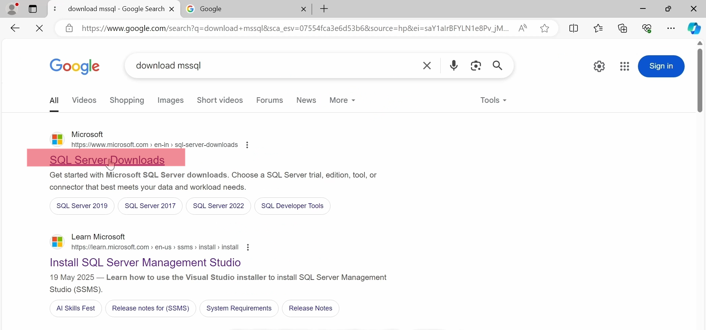

---

### 2️⃣ Open SQL Server Downloads page
You are now on the official **SQL Server Downloads** page on microsoft.com.

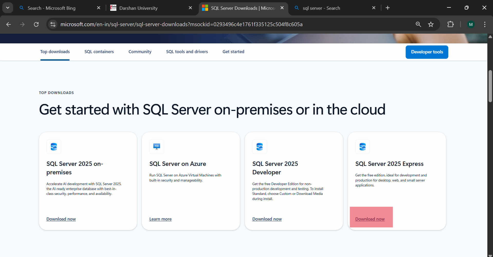

---

### 3️⃣ Choose SQL Server Express
On the **Top downloads** section, find **SQL Server 2025 Express** (or latest Express version) and click **Download now**.


---

### 4️⃣ Run SQL Server Express installer
After the download finishes, run the **SQL Server Express** installer.  
In the **SQL Server 2022 Express Edition** window, choose **Basic** installation.

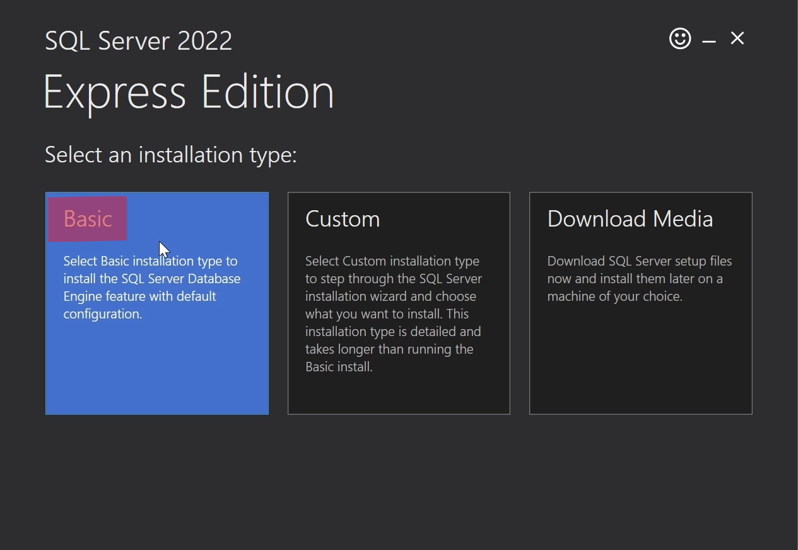

---

### 5️⃣ Accept license terms
Read the **Microsoft SQL Server License Terms** and click **Accept**.

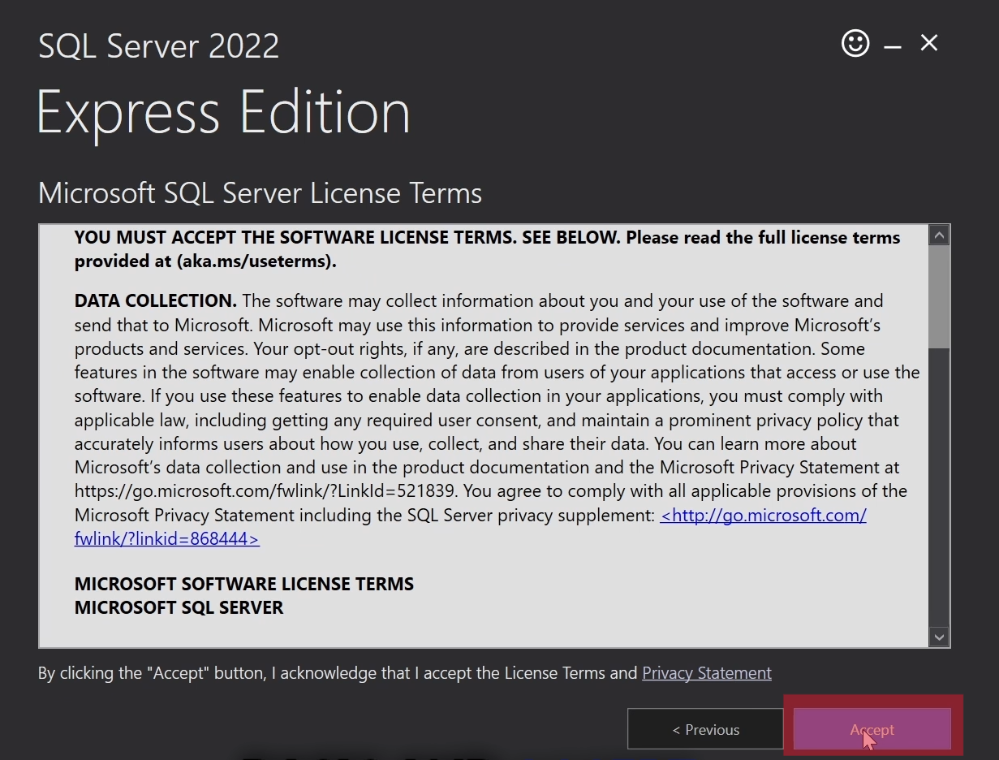

---

### 6️⃣ Wait for SQL Server to install
The installer will now download and install the SQL Server Express Database Engine with default settings.  
When it finishes, close the installer.

*(No extra configuration is required for this basic setup.)*


---

### 7️⃣ Download SQL Server Management Studio (SSMS)
Open the **SQL Server Management Studio** documentation/download page and click:

**“Download the SQL Server Management Studio SSMS 22 installer”**.

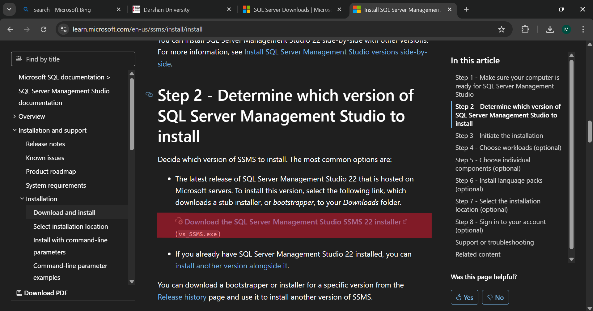

---

### 8️⃣ Allow installer to run (UAC prompt)
Run the downloaded SSMS installer.  
When Windows shows **User Account Control**, click **Yes** to allow **Visual Studio Installer** to make changes.

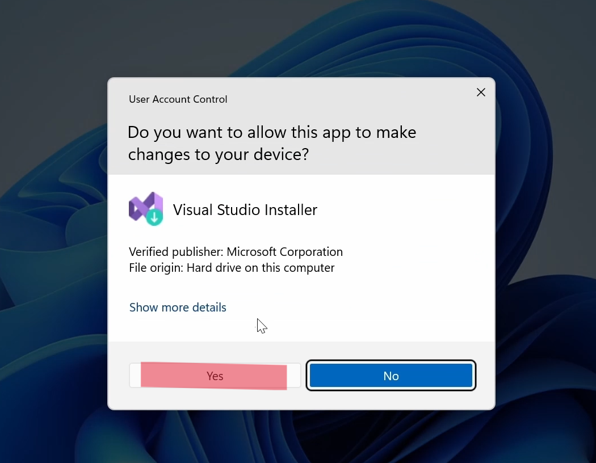

---

### 9️⃣ Start Visual Studio Installer
The **Visual Studio Installer** shows a welcome dialog. Click **Continue**.

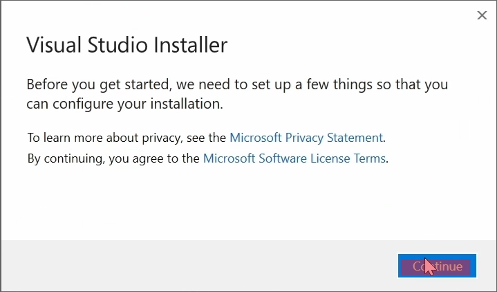

---

### 🔟 Select SSMS workloads
On the **Workloads** tab, you will see options such as:

- AI Assistance  
- Business Intelligence  
- Hybrid and Migration  
- Code tools  

Leave the defaults selected (or adjust as you prefer). These include SSMS core components.

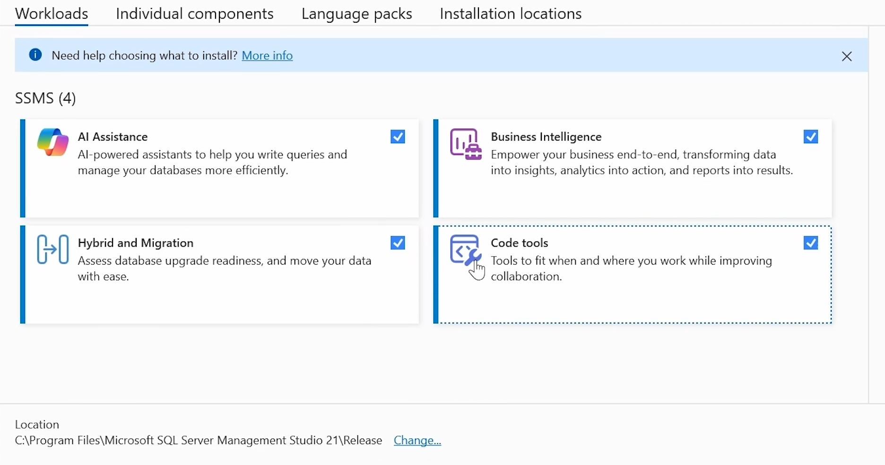

---

### 1️⃣1️⃣ Review installation details & optional tools
On the right side, under **Installation details**, you can see:

- SSMS Core Components  
- AI Assistance  
- Business Intelligence  
- Hybrid and Migration  
- Code tools (with optional Git / Help Viewer)  

Keep the defaults. At the bottom, click **Install**.

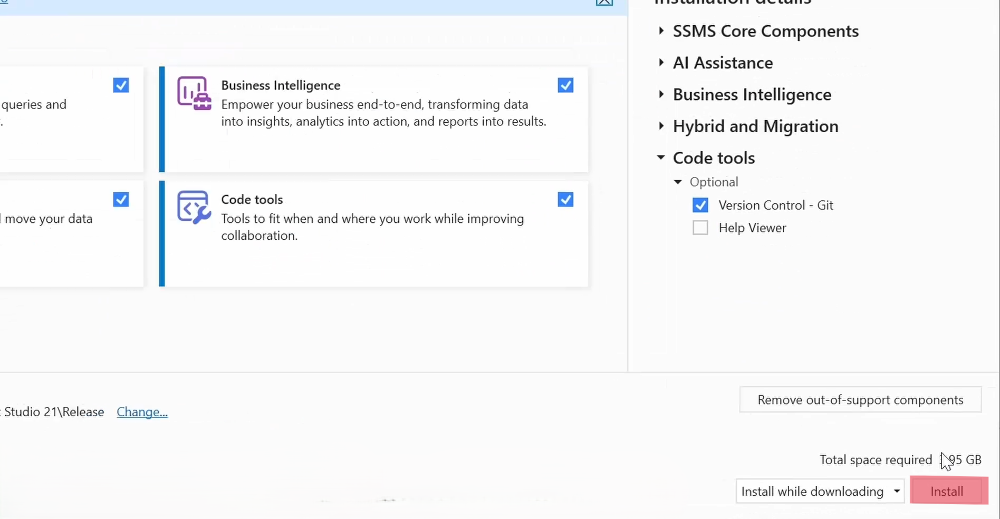

---

### 1️⃣2️⃣ Finish SSMS installation
Wait while SSMS is installed.  
When you see **“Done installing – The installation has completed successfully”**, click **OK**.

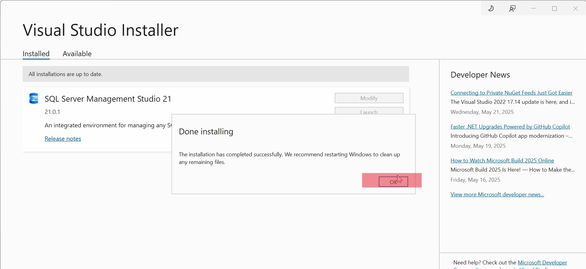

---

### 1️⃣3️⃣ Launch SQL Server Management Studio
Open the Start menu, search for **“SQL Server Management Studio”**, and launch it.

On first start, a sign-in screen appears. Click **“Skip and add accounts later.”**

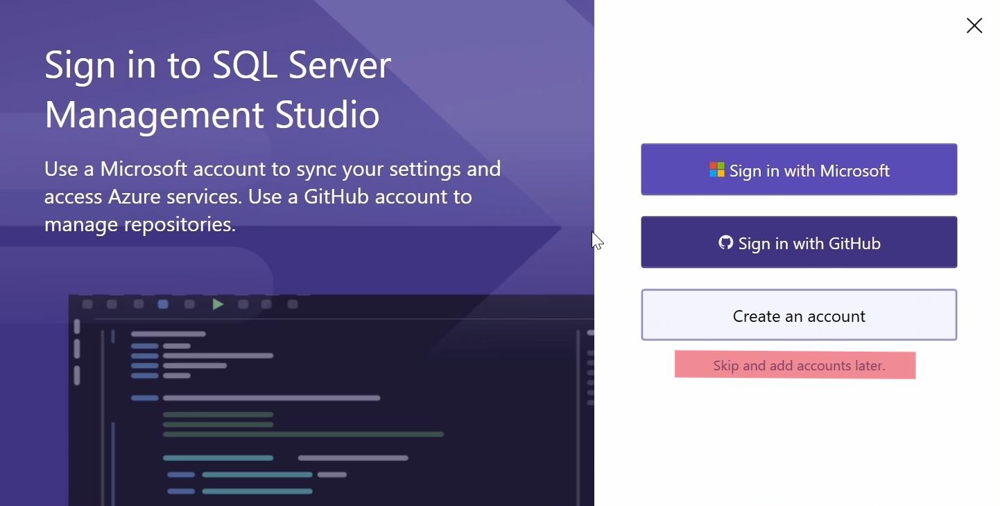

---

### 1️⃣4️⃣ Choose connection dialog experience
SSMS may ask if you want to try the **new connection dialog experience**.  
You can click **Yes** (or **No**; it doesn’t affect the server connection).

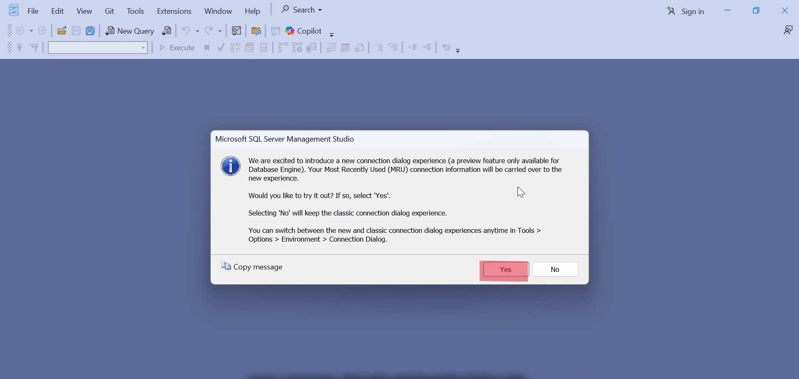

---

### 1️⃣5️⃣ Open Connect to Server window
Now you see the **Connect to Server** window.  
The **Server name** box is currently empty. Leave **Authentication** as **Windows Authentication**.

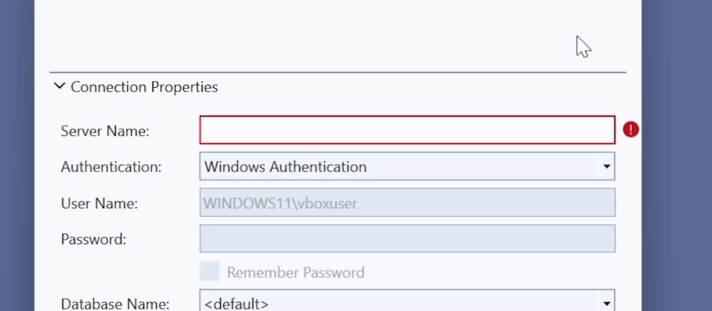

---

### 1️⃣6️⃣ Open System Information
To find your computer name, open the Start menu, type **“System Information”**, and open the **System Information** app.

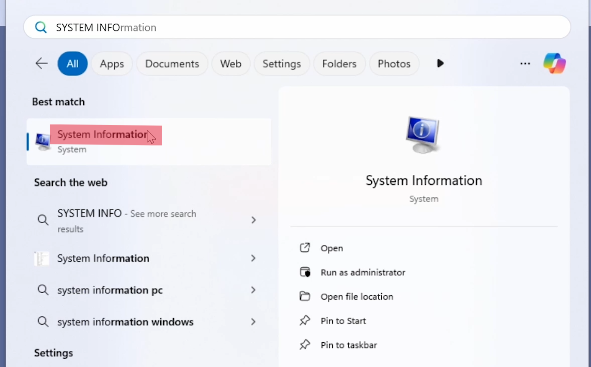

---

### 1️⃣7️⃣ Note your System Name
In **System Summary**, find the **System Name** value (for example, `WINDOWS11`).  
This is your machine name.

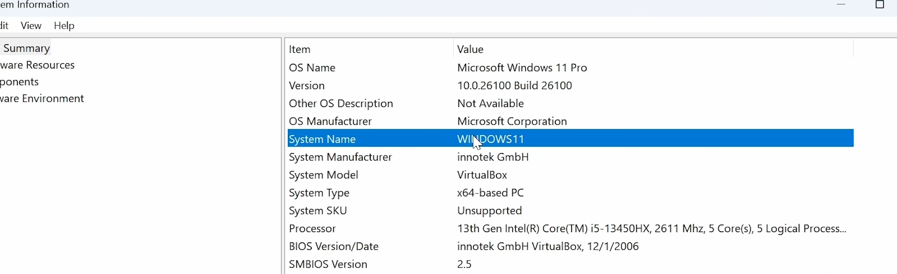

---

### 1️⃣8️⃣ Build the SQL Server instance name
Your local SQL Server Express instance name is:

```text
<SystemName>\SQLEXPRESS
```

Example:

```text
WINDOWS11\SQLEXPRESS
```

This is what you will enter into **Server name** in SSMS.

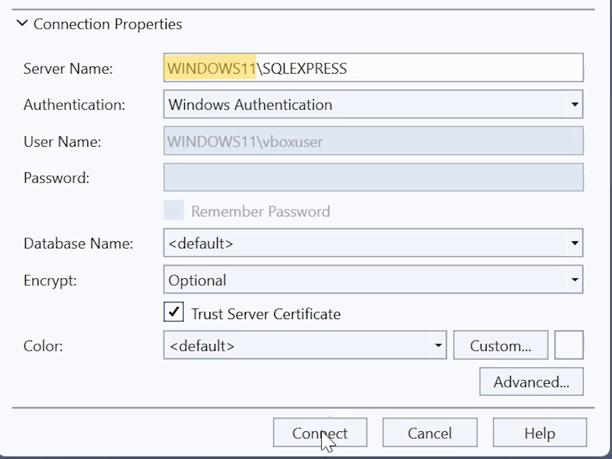

---

### 1️⃣9️⃣ Connect from SSMS
Return to the **Connect to Server** window in SSMS and fill in:

- **Server name:** `WINDOWS11\SQLEXPRESS` (replace with your actual System Name)  
- **Authentication:** Windows Authentication  
- Optionally tick **Trust Server Certificate**

Then click **Connect**.


---

### 2️⃣0️⃣ Verify successful connection
If everything is correct, SSMS will connect to your SQL Server Express instance.  
In the **Object Explorer** on the left, you should see your server and system databases like **master**, **model**, **msdb**, and **tempdb**.

You have successfully:

- Installed **SQL Server Express**  
- Installed **SQL Server Management Studio (SSMS)**  
- Connected to your local SQL Server instance ✅


---

## ✅ You’re Ready to Use SQL Server

Now you can:

- Create your own databases  
- Write and run SQL queries  
- Practice for exams or development work

Happy querying! 🎉
